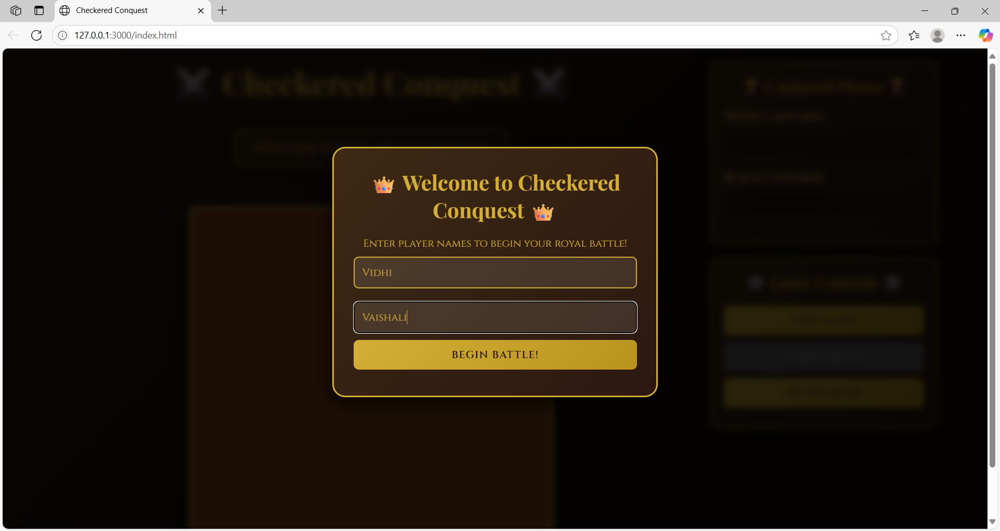
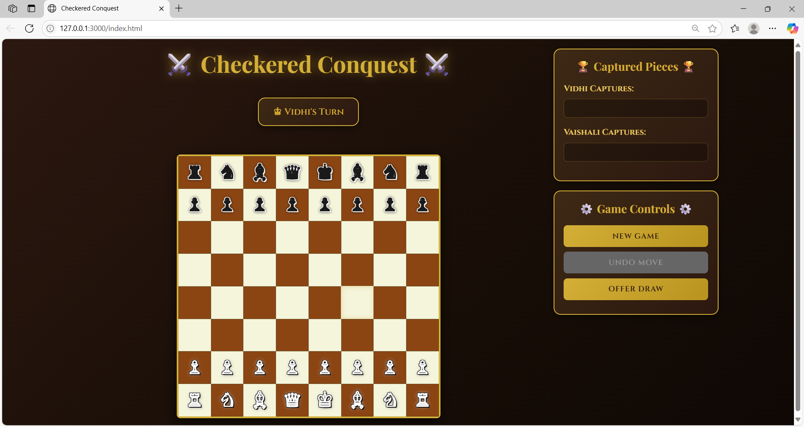

# ♛ Checkered Conquest ♛  
_A Royal Chess Game of Strategy and Honor_


## 🎯 Overview

**Checkered Conquest** is a beautifully crafted, two-player browser-based chess game built with pure **HTML**, **CSS**, and **JavaScript**. Designed with a royal and elegant theme, this game offers both an immersive visual experience and a complete, rules-compliant chess match between two players.

Whether you're a seasoned strategist or a casual player, Checkered Conquest invites you to battle in a classic, yet majestic, environment.

## 🔗 Live Demo

Play the game here:  
👉 **[Checkered Conquest – Play Now]()**


## 🕹️ Features

- 🎮 **Two-Player Local Match**  
  Prompt for both player names at the start of each game.

- ♟️ **Complete Chess Rule Set**
  - Basic piece movement
  - **Castling**
  - **En Passant**
  - **Pawn Promotion**
  - **Check**, **Checkmate**, **Stalemate**
  - **Draw by Insufficient Material**

- 🎯 **Turn Indicator**  
  Shows whose move it is, using actual player names.

- 🏆 **Scoreboard**  
  Captured pieces are displayed in real time for each player.

- 🔄 **Game Controls**
  - Start a new game
  - Undo the last move
  - Offer a draw

- 🌟 **Royal UI Design**
  - Elegant fonts and styling
  - Glowing move highlights and check indicators
  - Responsive layout for various screen sizes


## 📂 File Structure

```
📁 checkered-conquest/
├── index.html         # Main structure and modal for player names
├── style.css          # Elegant styling and board design
└── script.js          # Chess logic and interactivity
```


## 🚀 Getting Started

To play the game locally:

1. **Clone this repository**:
   ```bash
   git clone https://github.com/your-username/checkered-conquest.git
   cd checkered-conquest
   ```

2. **Open `index.html`** in your browser:
   - Just double-click the file, or
   - Use a local development server if desired.


## 📸 Preview

> _"A battlefield of minds, wrapped in gold and elegance..."_

  
  


## 🔧 Technologies Used

- **HTML5**
- **CSS3** (including Flexbox & animations)
- **Vanilla JavaScript** (no external libraries)


## ✍️ Author

**Your Name**  
[GitHub](https://github.com/Vidhi-P05)  
[LinkedIn](https://linkedin.com/in/vidhi-pateliya)  
Email: vid23pateliya@gmail.com


If you enjoyed this project, give it a ⭐ and share the royal battle with others!
